十六、从0开始卷出一个新项目之再谈瑞萨RZN2L固件升级
===
[toc]
# 一、概述
- 其实早在[六、从0开始卷出一个新项目瑞萨RZN2L之loader app分离工程优化](https://mp.weixin.qq.com/s?__biz=MzkxNDQyMTU4Mg==&mid=2247484461&idx=1&sn=3d65e58124700c3d6cb87c4c6fa51c9a&chksm=c16fe60cf6186f1a5b86db8a057b187874db35351daac032c43a61c22979a1430e94a5c634ff&scene=178&cur_album_id=3167963498191110153#rd)，我们就分享了通过loader+app（FSP1.1.0）实现固件升级
- 但是近期升级到FSP2.1.0确实不好用了，本文分享新的工程源码和其中的问题
- 源码只包括工程构建和必备的功能，例如固件具体传输、校验需自行实现

# 二、源码和问题说明
- 提供了基于FSP1.1.0和FSP2.1.0的官方的loader+app双工程
  RZN2L_bsp_xspi0bootx1_loader_fsp110
  RZN2L_bsp_xspi0bootx1_app_fsp110

  RZN2L_bsp_xspi0bootx1_loader_fsp200
  RZN2L_bsp_xspi0bootx1_app_fsp110

- 可以通过串口/usb来查看loader引导app的过程
- 可以通过串口、usb、以太网等在loader中传输固件，需自己实现
- 低于FSP1.3.0版本升级到FSP2.0.0以上版本，启动和链接文件改动较大。
- 源码是较通用的加载方式，更高级的分散加载需要自行修改，可以参考w我的[十一、从0开始卷出一个新项目之瑞萨RZN2Lrzn2l_coremark_fsp200工程构建和gcc .ld链接文件的修改方法](https://mp.weixin.qq.com/s?__biz=MzkxNDQyMTU4Mg==&mid=2247485293&idx=1&sn=dab3ac3d4144489e598472ca9ea362d8&chksm=c16fe54cf6186c5aa655143fc9ce6a6ecaf081a5cf89e8c0566595988c5f92bb0d895ac9b512&cur_album_id=3167963498191110153&scene=190#rd)和[
嵌入式科普(21 22 29)c代码究竟是如何一步步运行的](https://mp.weixin.qq.com/mp/appmsgalbum?__biz=MzkxNDQyMTU4Mg==&action=getalbum&album_id=3479634501515608066&scene=173&subscene=&sessionid=svr_aa93455b739&enterid=1739970749&from_msgid=2247485627&from_itemidx=1&count=3&nolastread=1#wechat_redirect)

- 新旧版本使用的GCC编译器也影响
- FSP驱动存在未判断回调函数是NULL的bug

# 三、重新理解芯片引导启动过程
- 芯片启动

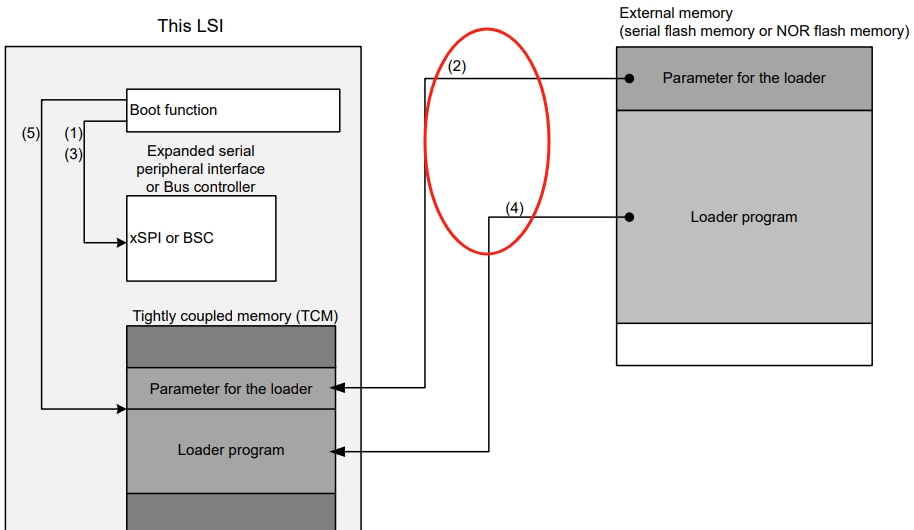
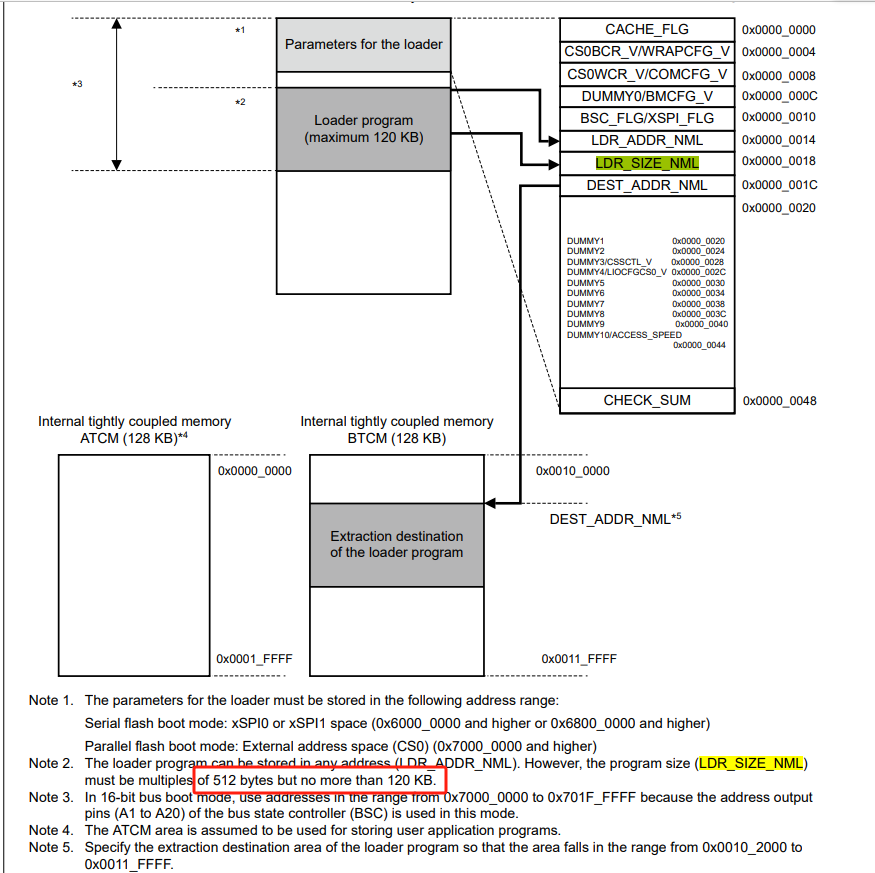
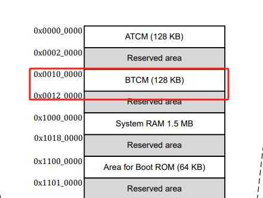
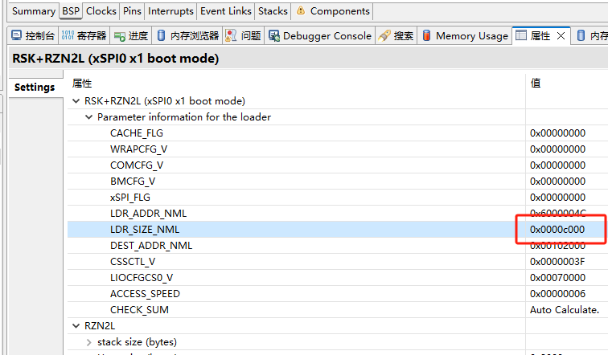

- loader text
 
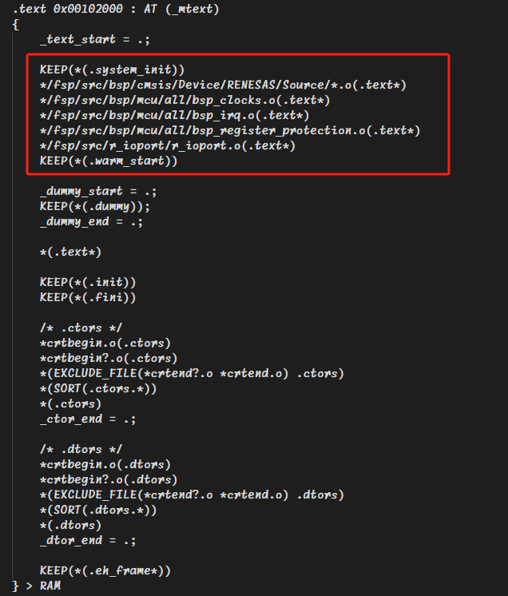
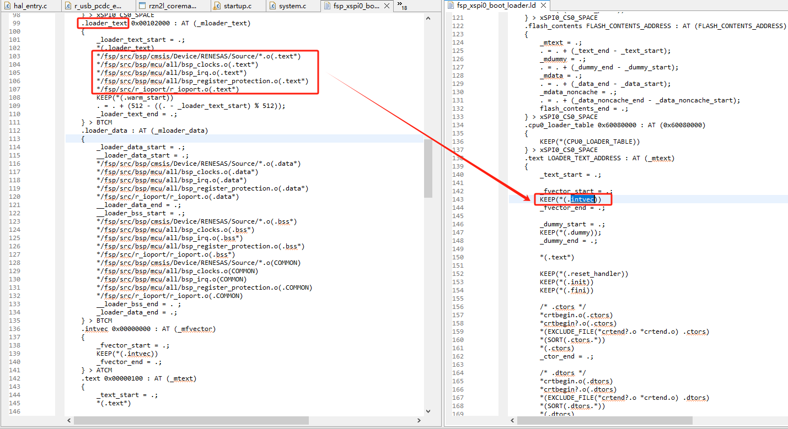

- loader startup本质

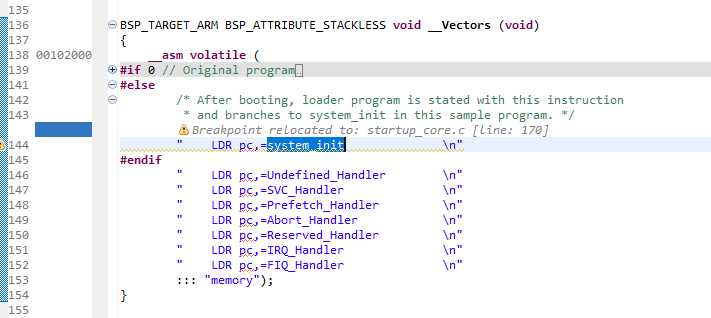
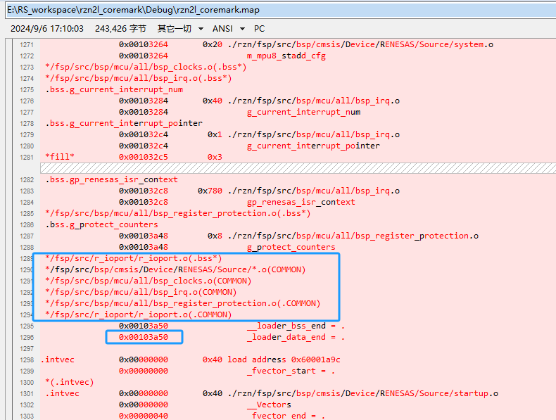
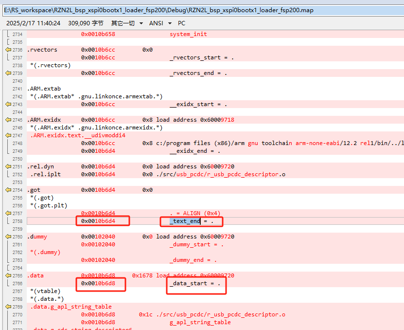
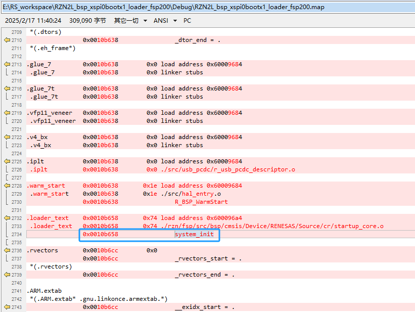

# 四、固件加密
- OTP和UID

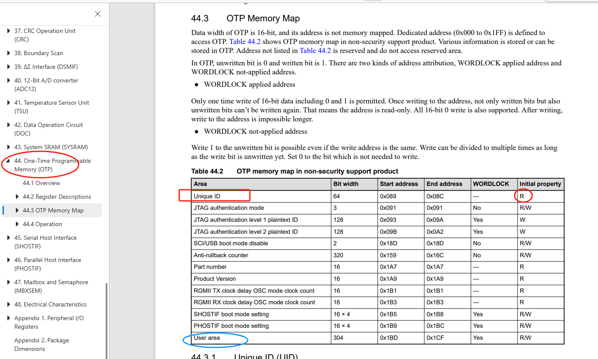
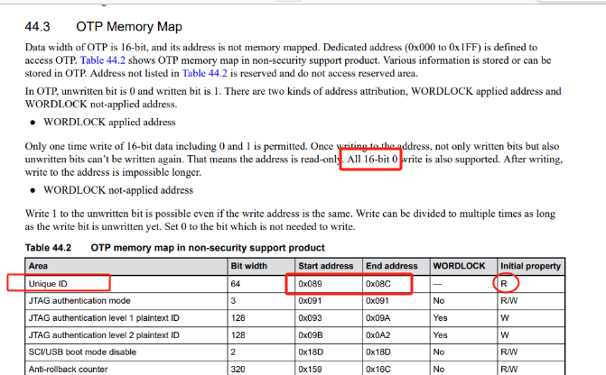
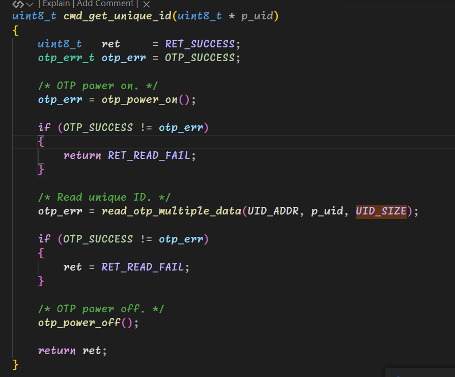

- AES加密
  https://github.com/kokke/tiny-AES-c

# 五、其他固件升级方案
- UART/USB启动
  参见相关例程

- EtherCAT FOE
  参见相关例程，带双分区

- 以太网升级例程
  未提供xspi版本

# 六、总结
- 回头再看芯片启动过程、升级固件引导过程还是细节很多，未理解本质一定会碰到问题
- loader+app属于熟知的“IAP升级”有灵活性；UART/USB启动、EtherCAT FOE只需要很少的研发投入
- 固件加密的思考

