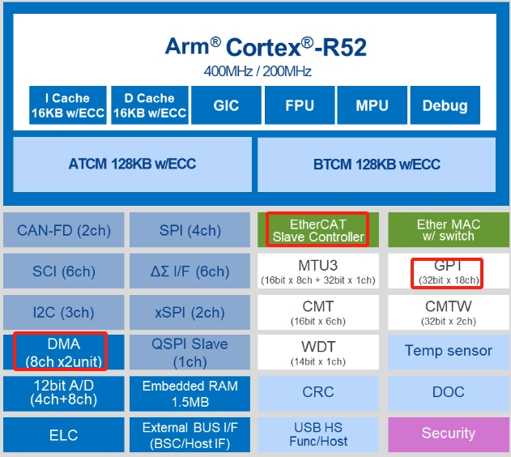
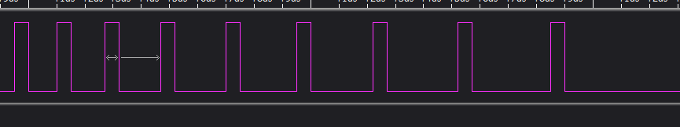
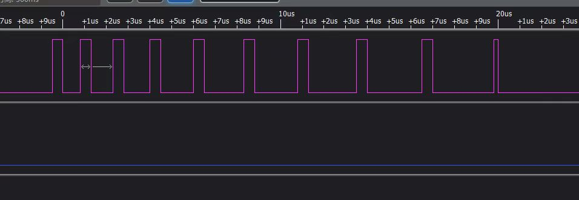
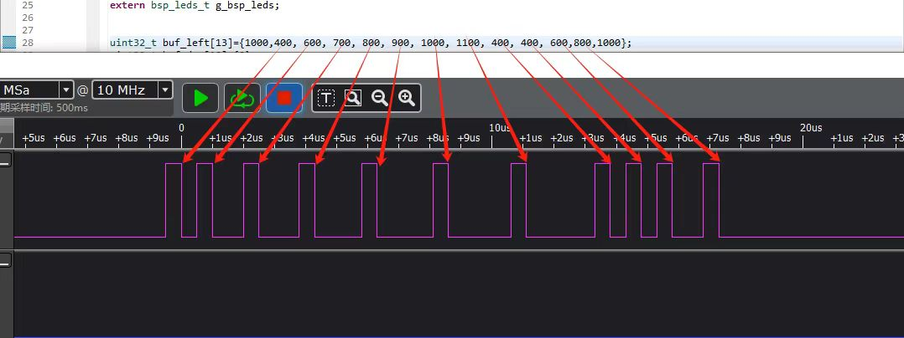
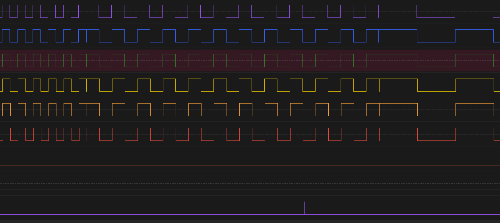

十七、从0开始卷出一个新项目之瑞萨RZN2L定时器(GPT)+DMA生成PWM的运动控制
===
[toc]


# 一、概述
- [嵌入式科普(34)通过对比看透DMA的本质](https://mp.weixin.qq.com/s/ohXTGt7M7WSh40x4tn9q4A)
- 分享瑞萨RZN2L使用DMA生成PWM的运动控制的例程源码
- rzn2l必要的外设资源：
  - rzn2l拥有32-bit timer General PWM Timer (GPT)  with 18 channels
  - CPU、GPT最高频率400Mhz
  - DMAC0 and DMAC1  8 channels + 8 channels
  - 还有cmt、cmtw、mtu3等其他定时器
  - ESC控制器


 

# 二、工程源码
```
__asm volatile ("cpsie i");

    g_timer0.p_api->open(g_timer0.p_ctrl, g_timer0.p_cfg);
    g_timer0.p_api->enable(g_timer0.p_ctrl);
    g_timer0.p_api->start(g_timer0.p_ctrl);

    g_transfer0.p_api->open(g_transfer0.p_ctrl, g_transfer0.p_cfg);

    g_transfer0_ctrl.p_cfg->p_info->p_src = (void*)&buf_left[0];
    g_transfer0_ctrl.p_cfg->p_info->p_dest = (void*)&g_timer0_ctrl.p_reg->GTPBR;//(void*)&buf_des[0];//(void*)&g_timer0_ctrl.p_reg->GTPBR;
    g_transfer0_ctrl.p_cfg->p_info->length = 40;
    g_transfer0.p_api->reconfigure(g_transfer0.p_ctrl, g_transfer0_ctrl.p_cfg->p_info);

    g_transfer0.p_api->enable(g_transfer0.p_ctrl);
    g_transfer0.p_api->softwareStart(g_transfer0.p_ctrl, (transfer_start_mode_t)0);
```

# 三、测试效果





# 四、总结
- rzn2l具备实现运动控制的重要资源，可实现1Mhz的效果
- 例程仅提供GPT+DMA的使用
