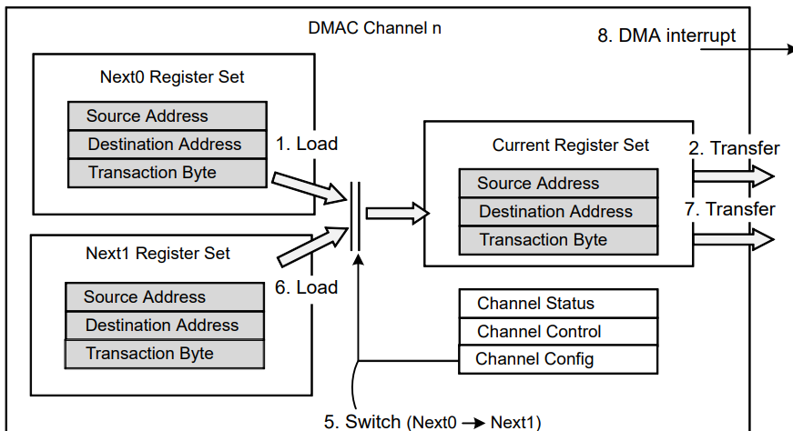
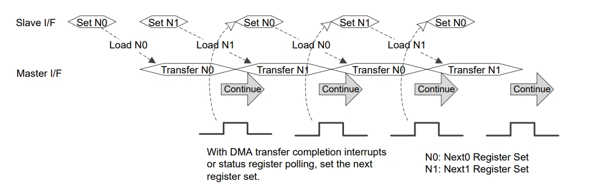

十八、从0开始卷出一个新项目之瑞萨RZN2L使用ADC+DMA接收数据流
===
[toc]


# 一、概述
- [嵌入式科普(34)通过对比看透DMA的本质](https://mp.weixin.qq.com/s/ohXTGt7M7WSh40x4tn9q4A)
- 如何高效的、无损的接收adc的连续数据流，分享RZN2L使用DMA连续接收ADC数据的例程源码
- 对比stm32 dma所谓的“循环/双buf模式”，和TI dma所的的“pingpong模式”。rzn2l如何实现？优劣势又是什么？
  
# 二、对比stm32 adc+dma“双buf模式”
- 网上非常多的文章介绍，其核心就是DMA的“循环/双buf模式”
  https://blog.csdn.net/sherlock_cp/article/details/128308375


# 三、瑞萨rzn2l dma寄存器模式(双配置模式)
- 但是rzn2l dma没有“循环/双buf模式”
- 如何按照“双buf模式”，去分析dma框图，很可能会造成思路混乱、逻辑不通。因为只有一张单方向传输的框图。
- 个人总结rzn2l dma的“双buf模式”应该叫“**双配置模式**”



# 四、例程源码



```
__asm volatile ("cpsie i");

    // Must be before dma cfg!!!!!!!!!!!!
    g_adc103.p_api->open(g_adc103.p_ctrl, g_adc103.p_cfg);

#if ENABLE_DMA
    g_transfer0.p_api->open(g_transfer0.p_ctrl, g_transfer0.p_cfg);

    g_transfer0_ctrl.p_cfg->p_info->p_src = (void*)&g_adc103_ctrl.p_reg->ADDR[3];
    g_transfer0_ctrl.p_cfg->p_info->p_dest = (void*)&adc_dest0[0];
    g_transfer0_ctrl.p_cfg->p_info->length = sizeof(g_adc103_ctrl.p_reg->ADDR[3]) * BUF_LEN;
#if 1
    g_transfer0_ctrl.p_cfg->p_info->p_next1_src = (void*)&g_adc103_ctrl.p_reg->ADDR[3];
    g_transfer0_ctrl.p_cfg->p_info->p_next1_dest = (void*)&adc_dest1[0];
    g_transfer0_ctrl.p_cfg->p_info->next1_length = sizeof(g_adc103_ctrl.p_reg->ADDR[3]) * BUF_LEN;
#endif
    g_transfer0.p_api->reconfigure(g_transfer0.p_ctrl, g_transfer0_ctrl.p_cfg->p_info);

    //reconfigure auto enable dma
    //g_transfer0.p_api->enable(g_transfer0.p_ctrl);
    //g_transfer0.p_api->softwareStart(g_transfer0.p_ctrl, (transfer_start_mode_t)0);
#endif


    g_adc103.p_api->scanCfg(g_adc103.p_ctrl, g_adc103.p_channel_cfg);
    g_adc103.p_api->scanStart(g_adc103.p_ctrl);
```
```
void g_transfer0CB(transfer_callback_args_t *p_args)
{
	(void)(p_args);
    dma_end_flg++;

    //To perform transfers in series, write 1 to the REN bit in the CHCFG_n register immediately!!!
    //So you can't resume debugging from the pause!!!
    //p_instance_ctrl->p_reg->GRP[group].CH[channel].CHCFG_b.REN = 1;
    g_transfer0_ctrl.p_reg->GRP[0].CH[0].CHCFG_b.REN = 1;

    if(dma_end_flg == 1)
    {
        //todo:data parse

    }
    else if(dma_end_flg == 2)
    {
        dma_end_flg = 0;

        //todo:data parse

    }

    return;
}
```

# 五、总结
- 瑞萨rzn2l可通过dma“**双配置模式**”去实现数据流传输
- 复杂dma功能需要我们对概念、框图分析、dma本质有更深层次理解