四、RZ/T2L-基于官方开发套件的BaseProject-coremark移植
======================

[toc]

---

参照【四、从0开始卷出一个新项目之瑞萨RZN2L软件基础工程构建】 https://www.bilibili.com/video/BV1cQ4y1p7of/?share_source=copy_web&vd_source=0b6b29722ed1b9adf9a9fa82857ec3a0
# 1 需要注意的小点

## 1.1 使用Flash运行调试前，新板子需要erase
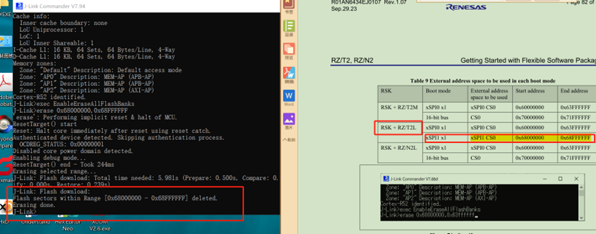
参照Getting Started with Flexible Software Package手册的附录，下载Jlink, 按着手册进行芯片擦除
## 1.2 在线debug，需要修改startup.c
参照Getting Started with Flexible Software Package手册的附录，在线debug，还需在starup.c添加  #if 1 // Software loops are only needed when debugging.的代码，如下图所示。
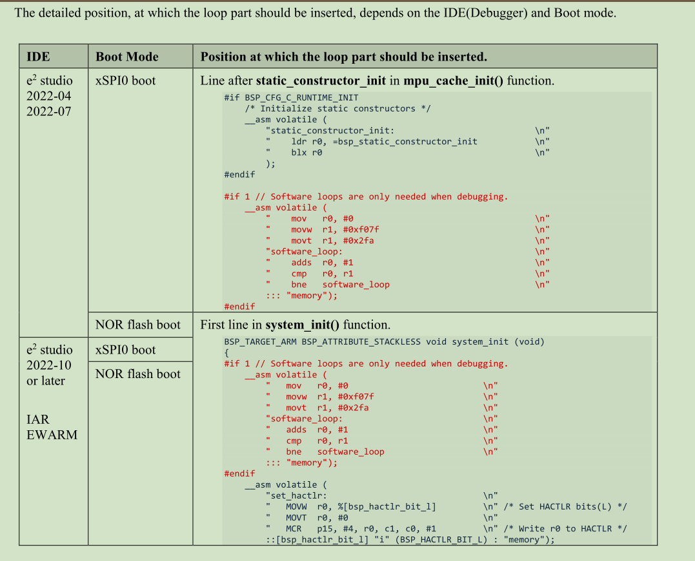
FSP 版本1.2和1.3生成的starup.c有所区别

# 2 coremark工程建立
使用开发套件自带配件：Jlink-Ob debug调试：J19 State: open，typeC-usb 电脑供电，USB串口线
使用FSPV1.2进行工程配置
## 2.1 工程创建
可以看视频创建流程，大致差不多，稍微有一点区别，可以参照一下下面的图。

最小工程-闪灯程序--hello world ！ for 开发板
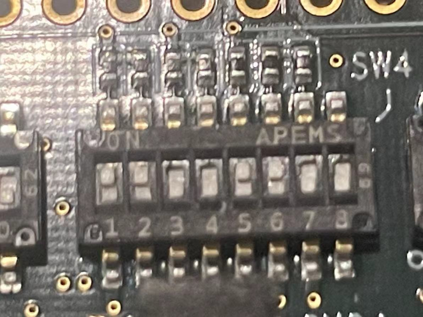
RSK FOR RZT2L : 挂载xspi1
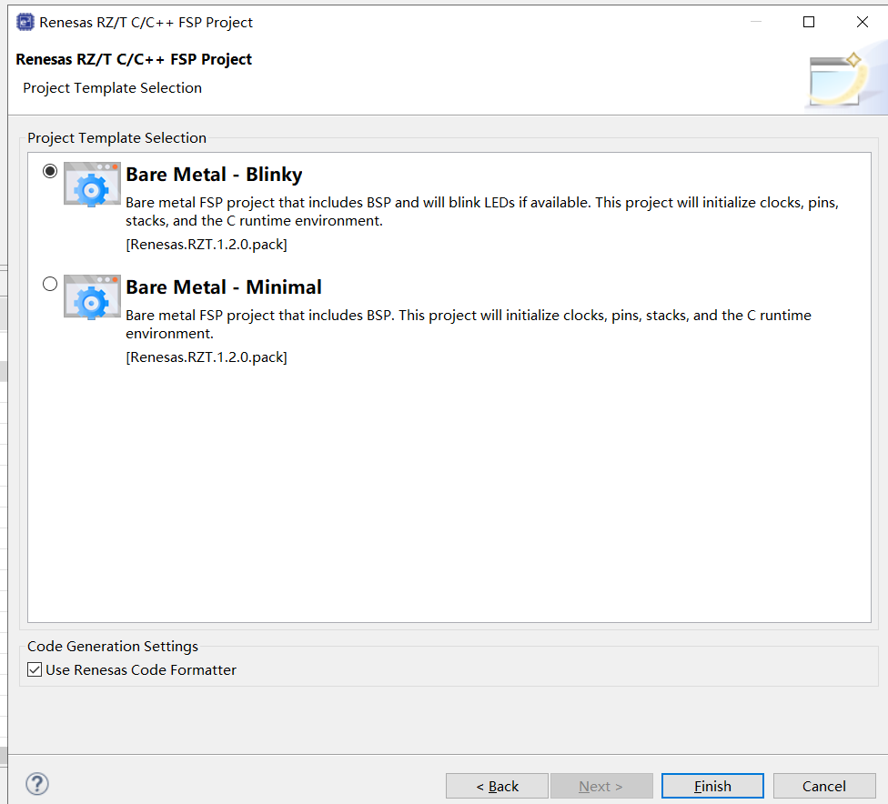
选择 SPI1 x1 boot mode
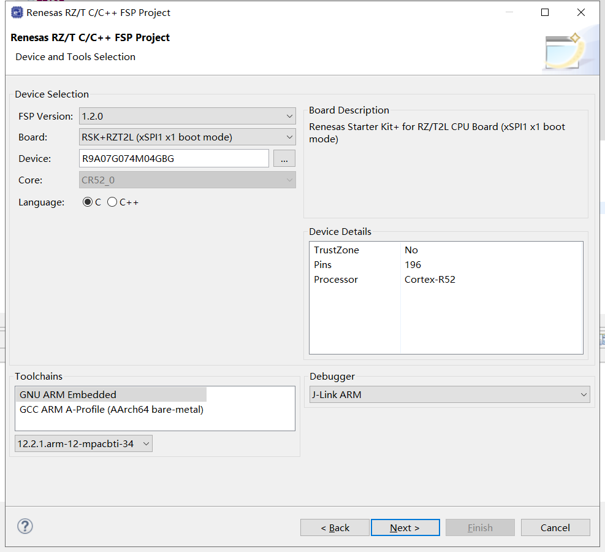
改成800M
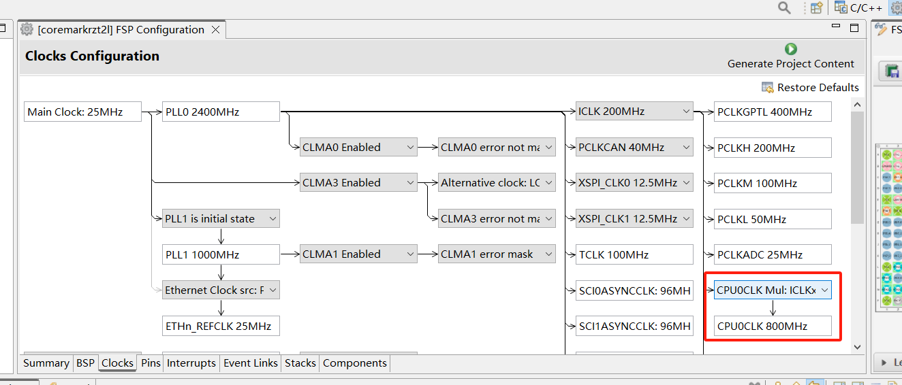
定时器配置
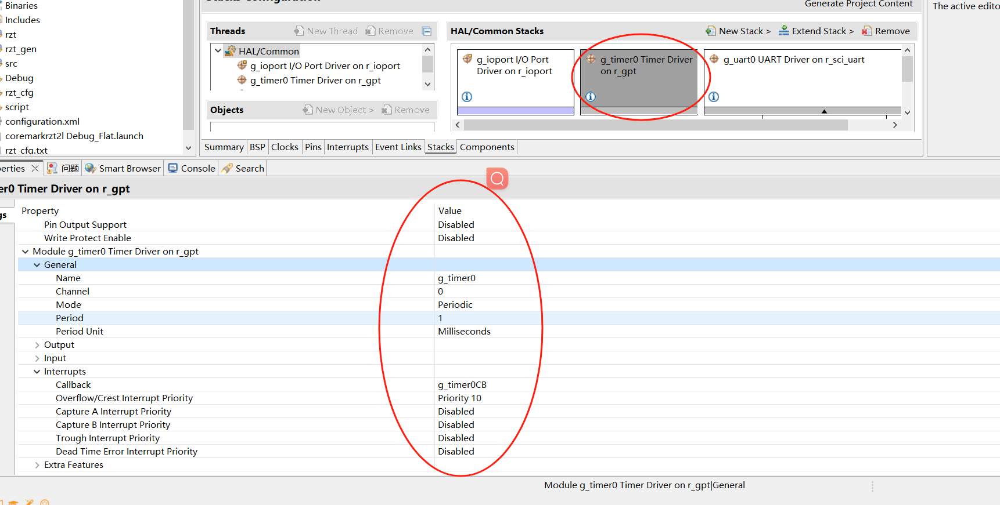
串口配置
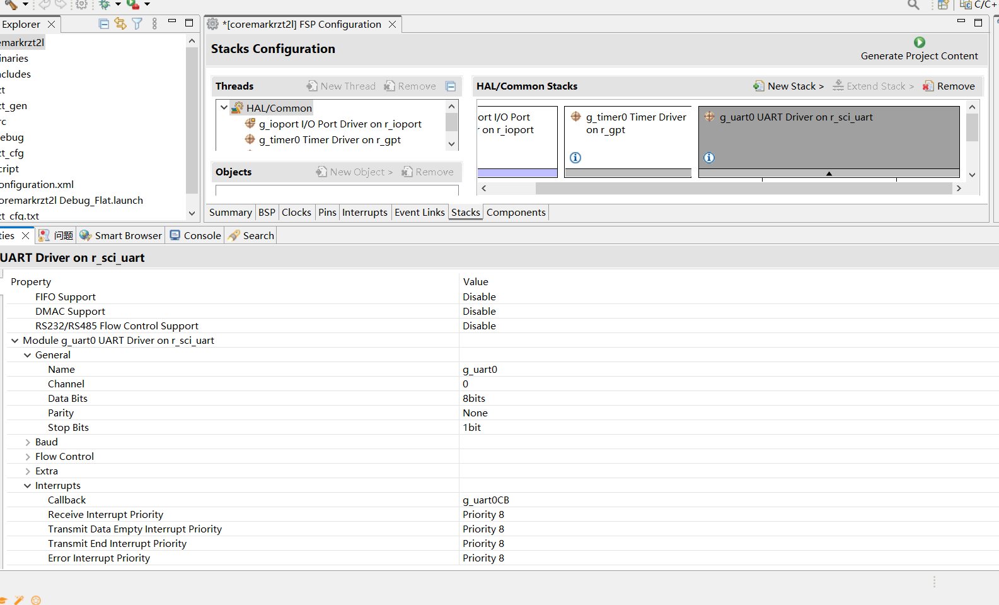

## 2.2 src 用户c代码移植
把coremark和下面的hal_entry.c 代码复制到src文件下
hal_entry.c 
>/***********************************************************************************************************************
 * Copyright [2020-2022] Renesas Electronics Corporation and/or its affiliates.  All Rights Reserved.
 *
 * This software and documentation are supplied by Renesas Electronics Corporation and/or its affiliates and may only
 * be used with products of Renesas Electronics Corp. and its affiliates ("Renesas").  No other uses are authorized.
 * Renesas products are sold pursuant to Renesas terms and conditions of sale.  Purchasers are solely responsible for
 * the selection and use of Renesas products and Renesas assumes no liability.  No license, express or implied, to any
 * intellectual property right is granted by Renesas.  This software is protected under all applicable laws, including
 * copyright laws. Renesas reserves the right to change or discontinue this software and/or this documentation.
 * THE SOFTWARE AND DOCUMENTATION IS DELIVERED TO YOU "AS IS," AND RENESAS MAKES NO REPRESENTATIONS OR WARRANTIES, AND
 * TO THE FULLEST EXTENT PERMISSIBLE UNDER APPLICABLE LAW, DISCLAIMS ALL WARRANTIES, WHETHER EXPLICITLY OR IMPLICITLY,
 * INCLUDING WARRANTIES OF MERCHANTABILITY, FITNESS FOR A PARTICULAR PURPOSE, AND NONINFRINGEMENT, WITH RESPECT TO THE
 * SOFTWARE OR DOCUMENTATION.  RENESAS SHALL HAVE NO LIABILITY ARISING OUT OF ANY SECURITY VULNERABILITY OR BREACH.
 * TO THE MAXIMUM EXTENT PERMITTED BY LAW, IN NO EVENT WILL RENESAS BE LIABLE TO YOU IN CONNECTION WITH THE SOFTWARE OR
 * DOCUMENTATION (OR ANY PERSON OR ENTITY CLAIMING RIGHTS DERIVED FROM YOU) FOR ANY LOSS, DAMAGES, OR CLAIMS WHATSOEVER,
 * INCLUDING, WITHOUT LIMITATION, ANY DIRECT, CONSEQUENTIAL, SPECIAL, INDIRECT, PUNITIVE, OR INCIDENTAL DAMAGES; ANY
 * LOST PROFITS, OTHER ECONOMIC DAMAGE, PROPERTY DAMAGE, OR PERSONAL INJURY; AND EVEN IF RENESAS HAS BEEN ADVISED OF THE
 * POSSIBILITY OF SUCH LOSS, DAMAGES, CLAIMS OR COSTS.
 **********************************************************************************************************************/
```
#include "hal_data.h"


void R_BSP_WarmStart(bsp_warm_start_event_t event) BSP_PLACE_IN_SECTION(".warm_start");

void user_copy_to_sram (void);

extern bsp_leds_t g_bsp_leds;

extern void atcm_user_init(void);
extern void coremain(void);//BSP_PLACE_IN_SECTION(".atcm");


///rzn2l may be not support segger rtt print, so exclude file SEGGER_RTT_V780c
#ifndef PRINTF
#define PRINTF
#endif
#ifdef PRINTF
#include <stdio.h>
/**
 * notice: g_uart0CB; g_uart0_ctrl
 *
 * e2s:
 * 1.uart0 callback:g_uart0CB
 * 2.FSP-BSP-heap size:0x400
 * 3.-u _printf_float
 * 4.other link void
 *
 * iar:
 * 1.uart0 callback:g_uart0CB
 * 2.FSP-BSP-heap size:0x400
 * 3.libray=full
 * 4.Semihosted=None
 *
 * keil:
 * 1.uart0 callback:g_uart0CB
 * 2.FSP-BSP-heap size:0x400
 */
volatile bool uart_send_complete_flag = false;
void g_uart0CB (uart_callback_args_t * p_args)
{
    if(p_args->event == UART_EVENT_TX_COMPLETE)
    {
        uart_send_complete_flag = true;
    }
}
#if defined __GNUC__ && !defined __clang__
int _write(int fd, char *pBuffer, int size); //??????
int _write(int fd, char *pBuffer, int size)
{
   (void)fd;
   fsp_err_t err = R_SCI_UART_Write(&g_uart0_ctrl, (uint8_t *)pBuffer, (uint32_t)size);
   if(FSP_SUCCESS != err) __BKPT();
   while(uart_send_complete_flag == false);
   uart_send_complete_flag = false;

   return size;
}
#else
int fputc(int ch, FILE *f)
{
   (void)f;
   fsp_err_t err = R_SCI_UART_Write(&g_uart0_ctrl, (uint8_t *)&ch, 1);
   if(FSP_SUCCESS != err) __asm("bkpt 0");
   while(uart_send_complete_flag == false);
   uart_send_complete_flag = false;

   return ch;
}
#endif//#if defined __GNUC__ && !defined __clang__
#endif//PRINTF

extern void func_atcm_bss_init (void);
///////////////////////////////////////////////
/*******************************************************************************************************************//**
 * @brief  Blinky example application
 *
 * Blinks all leds at a rate of 1 second using the software delay function provided by the BSP.
 *
 **********************************************************************************************************************/
void hal_entry (void)
{
    //R_BSP_SoftwareDelay(100, BSP_DELAY_UNITS_MILLISECONDS);

    /* Define the units to be used with the software delay function */
    const bsp_delay_units_t bsp_delay_units = BSP_DELAY_UNITS_MILLISECONDS;

    /* Set the blink frequency (must be <= bsp_delay_units */
    const uint32_t freq_in_hz = 2;

    /* Calculate the delay in terms of bsp_delay_units */
    const uint32_t delay = bsp_delay_units / freq_in_hz;

    /* LED type structure */
    bsp_leds_t leds = g_bsp_leds;

    /* 中断使能 */
//    __enable_irq();
    __asm volatile ("cpsie i");
    //    __ASM volatile ("cpsie i" : : : "memory");

#ifdef PRINTF
    g_uart0.p_api->open(&g_uart0_ctrl, &g_uart0_cfg);

    g_uart0.p_api->write(&g_uart0_ctrl, "Renesas\n", strlen("Renesas\n"));
    while(!uart_send_complete_flag);
    uart_send_complete_flag = false;
    printf("date:%s\ntime:%s\nfile:%s\nfunc:%s,line:%d\nhello world!\n", __DATE__, __TIME__, __FILE__, __FUNCTION__, __LINE__);

    float PI = 3.1415926;
    printf("PI=%f\n", PI);
#endif//PRINTF


    R_GPT_Open(&g_timer0_ctrl, &g_timer0_cfg);
    R_GPT_Start(&g_timer0_ctrl);
    R_GPT_Enable(&g_timer0_ctrl);

    printf("start coremain!!!\r\n");

    /* If this board has no LEDs then trap here */
    if (0 == leds.led_count)
    {
        while (1)
        {
            ;                          // There are no LEDs on this board
        }
    }

    /* This code uses BSP IO functions to show how it is used.*/
    /* Turn off LEDs */
    for (uint32_t i = 0; i < leds.led_count; i++)
    {
        R_BSP_PinClear(BSP_IO_REGION_SAFE, (bsp_io_port_pin_t) leds.p_leds[i]);
    }

#if FSP_XSPI1_BOOT_SRAM_ATCM//only use fsp_xspi0_boot_SRAM_ATCM.ld
    //first, change FSP_XSPI0_BOOT_SRAM_ATCM in project property - symbol
    //second，change .ld in project property cross arm c linker - general
    atcm_user_init();

    printf("use fsp_xspi1_boot_SRAM_ATCM.ld!!!\r\n");
#else
    printf("use fsp_xspi1_boot.ld or use fsp_xspi1_boot_SRAM_MIRROR.ld!!!\r\n");
#endif

    coremain();

    //default 200Mhz，modify fsp-clock  CPUOCLK Mul:ICLKx1 -> CPUOCLK Mul:ICLKx2
    uint32_t freq_hz = R_FSP_SystemClockHzGet(FSP_PRIV_CLOCK_CPU0);
    printf("FSP_PRIV_CLOCK_CPU0=%ld\r\n", freq_hz);


    while (1)
    {
        printf("running!!!\r\n");
        for (uint32_t i = 0; i < leds.led_count; i++)
        {
          R_BSP_PinToggle(BSP_IO_REGION_SAFE, (bsp_io_port_pin_t) leds.p_leds[i]);
        }
        R_BSP_SoftwareDelay(1000, BSP_DELAY_UNITS_MILLISECONDS);
    }

}


/*******************************************************************************************************************//**
 * This function is called at various points during the startup process.  This implementation uses the event that is
 * called right before main() to set up the pins.
 *
 * @param[in]  event    Where at in the start up process the code is currently at
 **********************************************************************************************************************/
void R_BSP_WarmStart (bsp_warm_start_event_t event)
{
    if (BSP_WARM_START_POST_C == event)
    {
        /* C runtime environment and system clocks are setup. */

        /* Configure pins. */
        R_IOPORT_Open(&g_ioport_ctrl, &g_bsp_pin_cfg);

    }
}

/*
 * g_timer0CB
 * rzn2l core R52 havenot systick, so init g_timer0 cnt
 */
extern volatile clock_t cnt;
void g_timer0CB(timer_callback_args_t *p_args)
{
    if (TIMER_EVENT_CYCLE_END == p_args->event)
    {
        cnt++;
    }
}
```
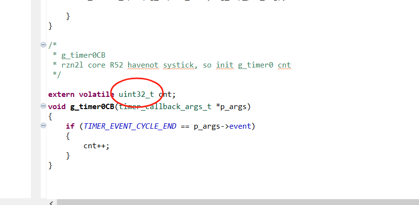
但不知道这里clock_t就是说未定义??其实是有定义的，，，
 该问题3.1节有提到

## 2.3 debug调试
startup.c line:380加入
```
>#if 1 // xpsi boot debug must software_loop+software_loop2.Software loops are only needed when debugging.
>     __asm volatile (
>         " mov r0, #0 \n"
>         " movw r1, #0xf07f \n"
>         " movt r1, #0x2fa \n"
>         "software_loop: \n"
>         " adds r0, #1 \n"
>         " cmp r0, r1 \n"
>         " bne software_loop \n"
>         ::: "memory");
>#endif
```
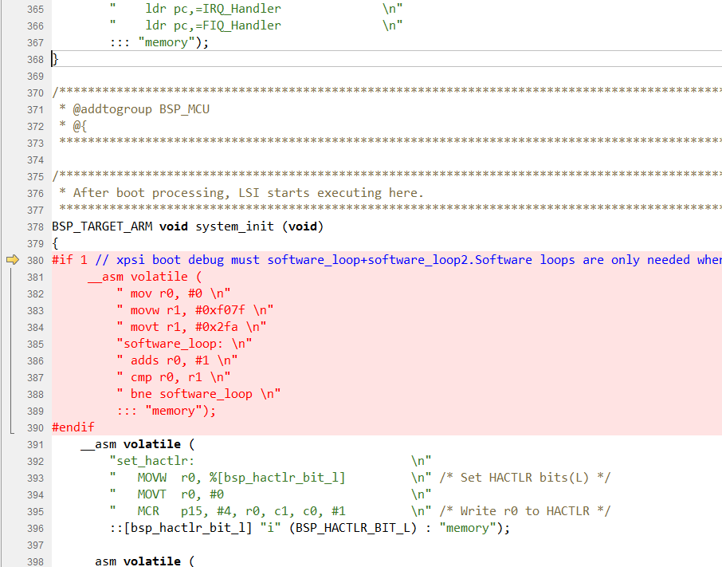

## 2.4 修改printf 重定向
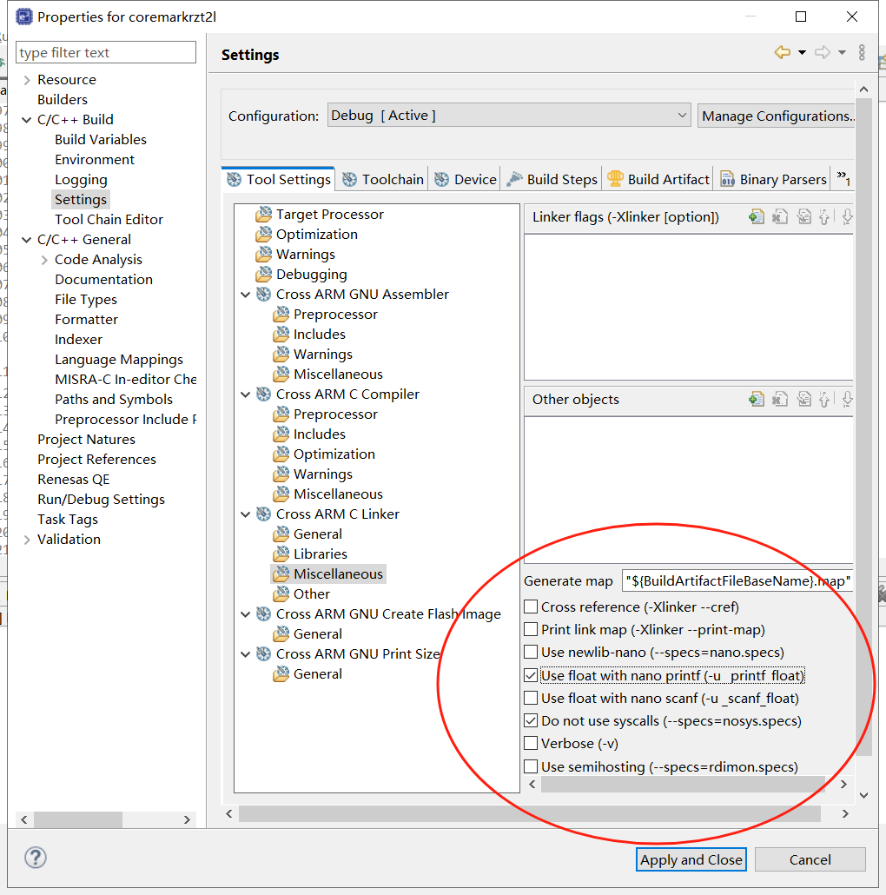
## 2.5 修改编译等级
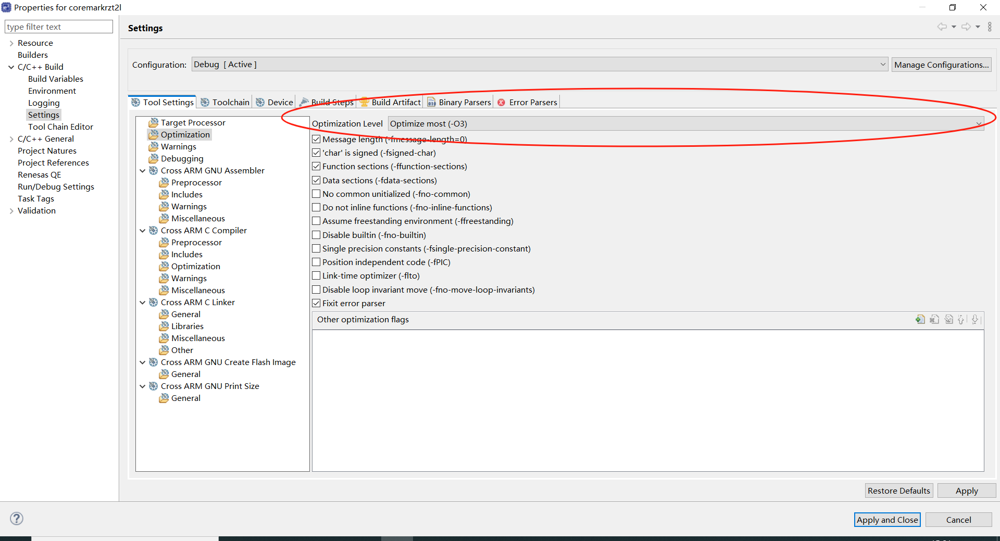
## 2.6 修改 迭代次数
20000--->30000
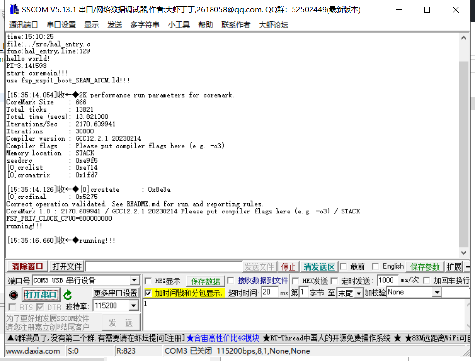

## 2.7 修改ld文件和system.c
ld文件
SRAM首选和ATCM次选的baseproject
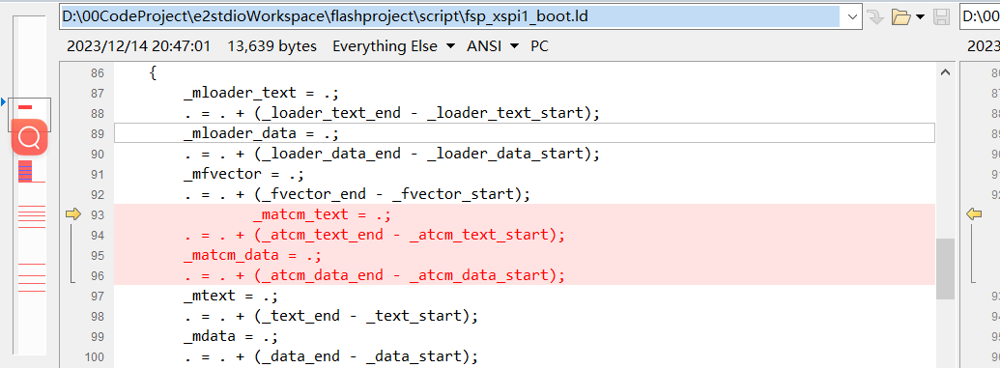

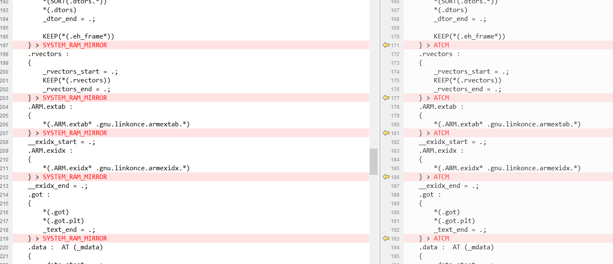
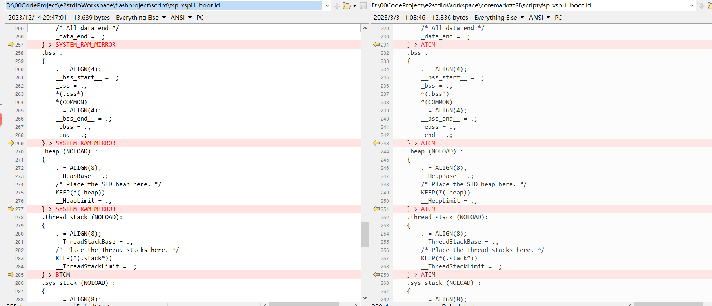
system.c
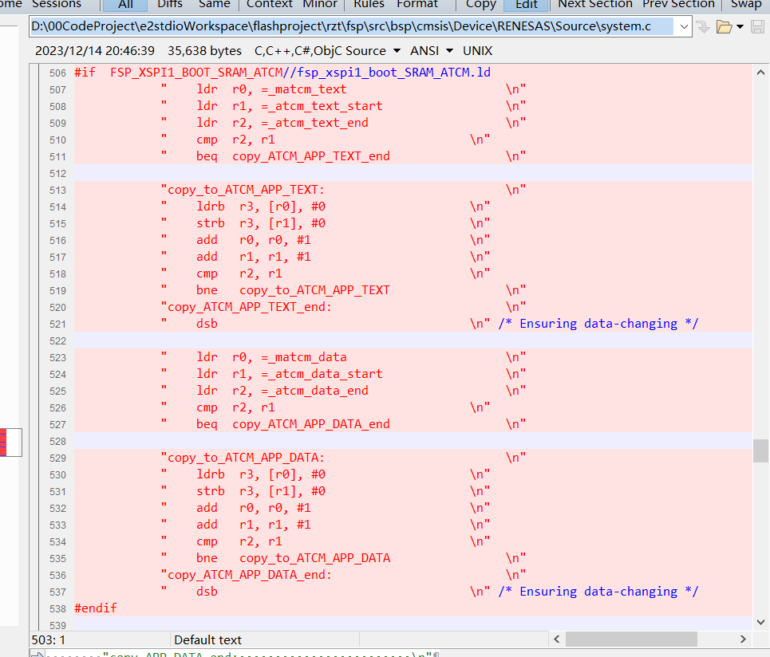
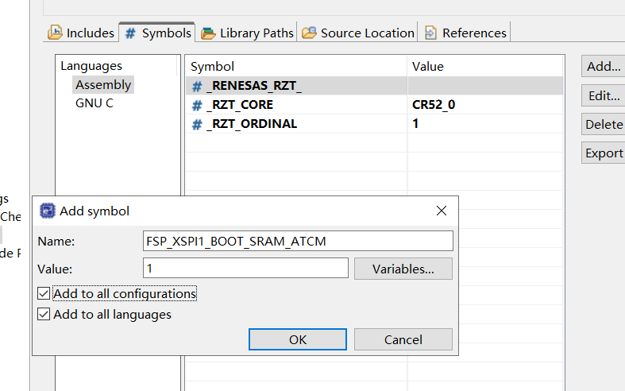
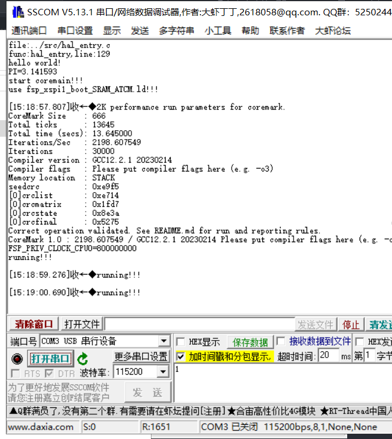

# 3 小结

非常感谢陈工的视频教程加上亲自的远程指导，废了很大的劲才能跑通，自己主要吃了没有文化的亏；其中还有一些细小问题未能解释,很多现象只能表述，还不能解释背后的原理，所以疑惑也较多；
## 3.1 clock_t编译报错问题
对于clock_t编译报错问题，选择下图的toolchain，可以解决，但为什么，很难解释。。从报错的提示看有提到toolchain 所以更换了。
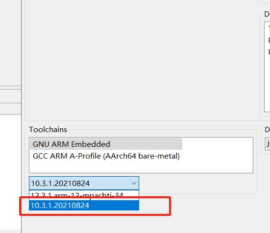
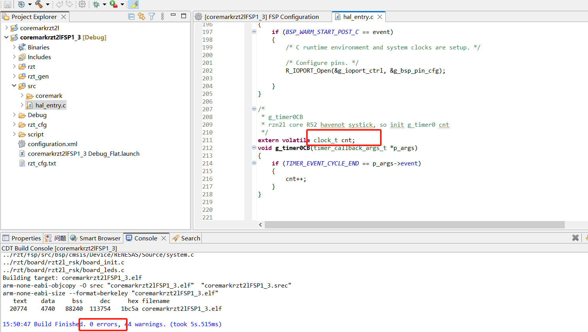
## 3.2 移植coremark的目的个人理解
coremark文件夹的源码在atcm运行，其他源码都是sram运行
移植coremark并且SRAM首选和ATCM次选的baseproject的目的，是让coremark代码选择在ATM上快速运行，
对于我后续移植开发，如果需要要求执行速度快的代码，也需要和修改coremark的system.c一样去修改，其他的应用代码移植过来直接默认在SRAM上。这一块如何去学习到灵活自主的修改能力？目前对于ld文件、system.c文件理解不是很透彻，还是简单的搬运！！
## 3.3 尝试FSP V1.30 
最开始尝试FSP V1.30 移植coremark，到2.4都是可以的，后续进行2.7ld文件、system.c的修改，首先版本差异导致这两个文件差异很大，其次修改后报了很多奇怪的错误，个人能力有限很难看懂。干脆改成FSP1.2了，希望有大佬能够搞定。我也学习下。
